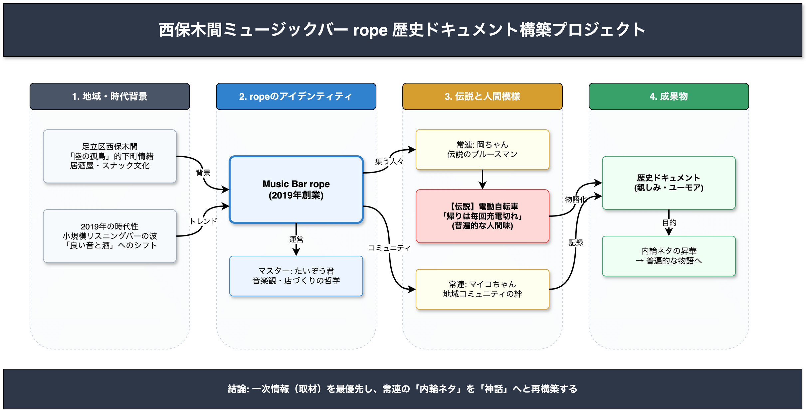
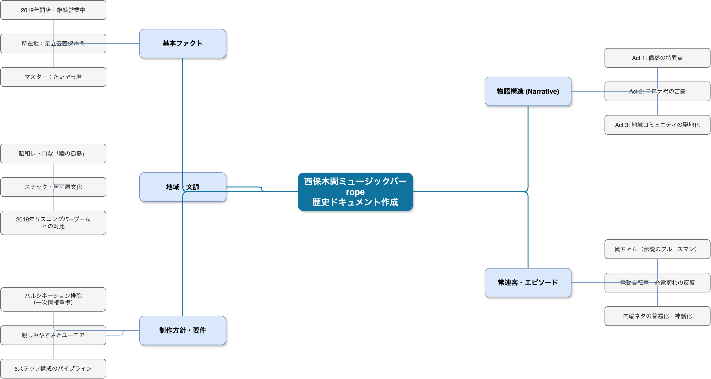
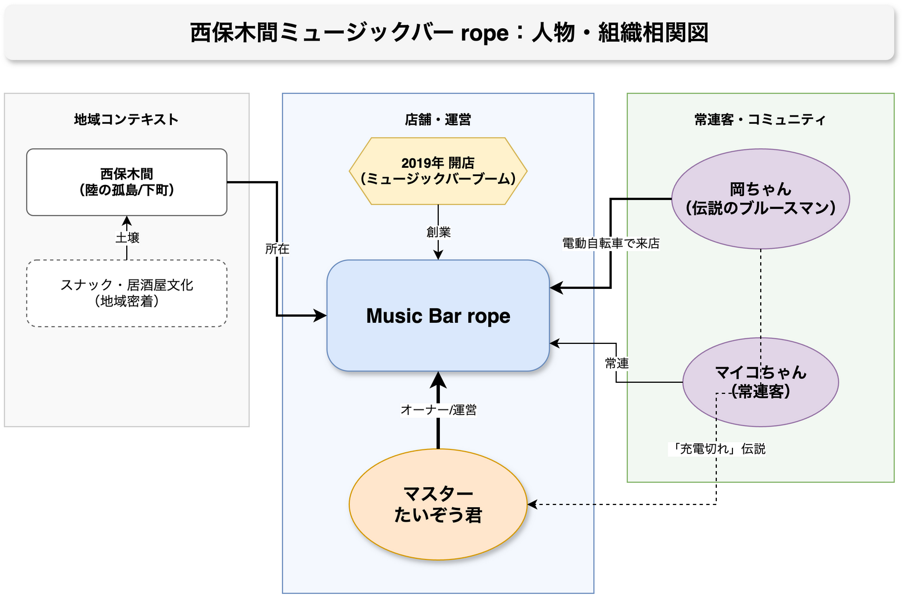
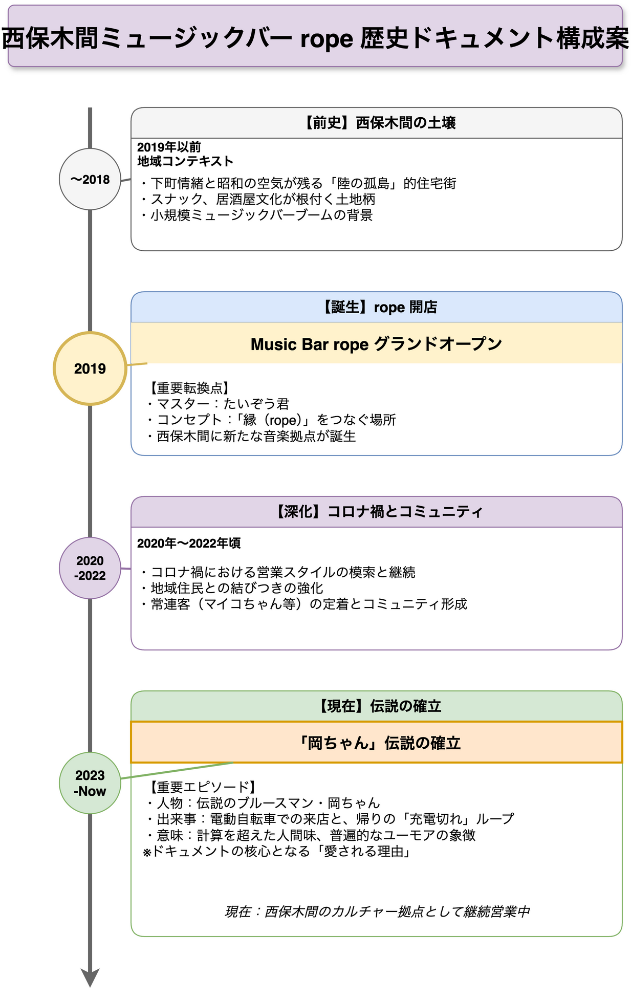

<!-- _class: title -->

# 西保木間ミュージックバーrope
# 歴史ドキュメント作成プロジェクト

2026-03-19
AI Research Agent (Pipeline v2.5.0)

---
<!-- _class: light -->

## Executive Summary

西保木間の「rope」とマスターたいぞう君の歩みを、地域と常連客の記憶と共に記録するプロジェクトです。

- **目的**: ropeの歴史を物語として再構成し、コミュニティの資産とする
- **対象**: 2019年の開店から現在までの歩み、および常連客のエピソード
- **手法**: AIによる多角的分析と、徹底した「一次情報（取材）」の融合
- **現状**: 物語の「骨格」と「登場人物」は特定完了。詳細なエピソードの肉付け段階へ移行中
- **トーン**: 音楽好きと常連客が楽しめる、ユーモアと愛着に満ちたドキュメント

---
<!-- _class: light -->

## 1. 地域文脈：西保木間という舞台 Medium

**Claim**: ropeの特異性は、昭和の面影残る「陸の孤島」的住宅街・西保木間に位置することにある。

- **証拠**: 竹ノ塚の歓楽街とは異なり、団地や古い商店が点在する生活圏。
- **背景**: おしゃれなバルより「赤提灯」「スナック」が似合う土壌。
- **意義**: ここにミュージックバーを開いたこと自体が、ある種の「文化的賭け」であり、ropeのアイデンティティとなっている。

---
<!-- _class: light -->

## 2. 時代背景：2019年の必然 Medium

**Claim**: 2019年の開店は、全国的な小規模ミュージックバー開業の潮流とリンクしている可能性がある。

- **証拠**: 当時は「良い音と酒」を静かに楽しむリスニングバースタイルのブーム期。
- **独自性**: 渋谷や下北沢ではなく足立区最北端を選んだ点に、マスターの独自の哲学（または縁）が存在する。
- **位置づけ**: 時代の「気分」と地域の「生活感」が交差するポイントとして誕生。

---
<!-- _class: light -->

## 3. 核心人物：マスターたいぞう君 High

**Claim**: 本ドキュメントの主人公であり、ropeの精神的支柱。

- **確定事実**: ropeのマスターであること。
- **人柄**: 常連客との距離感、音楽へのこだわり（取材による深掘りが必要）。
- **役割**: 単なる店主を超え、地域の音楽好きが集まるハブとしての機能を果たしている。
- **課題**: 開店に至る個人的な動機や経緯の詳細は、本人へのインタビューが必須。

---
<!-- _class: light -->

## 4. 店名「rope」の物語性 Medium

**Claim**: 店名は「つながり」のメタファーとして機能するが、由来は未確定である。

- **解釈の層**:
    1. 音楽と人をつなぐ「ロープ」
    2. 命綱としての「ロープ」
    3. 逃れられない縁としての「縛り」
- **現状**: AI分析では複数の詩的解釈が可能だが、真実はマスターの記憶の中にある。
- **方針**: この「名前の由来」こそが、物語の導入部（プロローグ）となる。

---
<!-- _class: light -->

## 5. 常連客の肖像：マイコちゃん High

**Claim**: ropeの日常を象徴する主要な常連キャラクター。

- **存在**: 店の空気を形成する重要な構成員として認識されている。
- **機能**: 彼女の視点やエピソードを通じて、ropeの日常風景を描写することが可能。
- **記録方針**: 特定の劇的エピソードだけでなく、何気ない会話や店での過ごし方を記録する。

---
<!-- _class: light -->

## 6. 伝説：岡ちゃんと電動自転車 High

**Claim**: 「伝説のブルースマン」岡ちゃんは、ropeのユーモアと人間味を象徴するアイコンである。

- **確定エピソード**: 電動自転車で来店するが、帰りは毎回充電が切れている。
- **構造**: 「意気揚々と来店」→「楽しい時間」→「充電切れのトホホな帰宅」という**様式美（反復構造）**が存在する。
- **重要性**: この「お約束」が常連間の共通言語となり、コミュニティの結束を強めている。

---
<!-- _class: light -->

## 7. 物語構造：普遍的神話への変換 Medium

**Claim**: 内輪ネタを外部の人も楽しめる「物語」にするには、意味レベルの変換が必要である。

- **分析**: 岡ちゃんの充電切れは単なる失敗談ではない。
- **普遍的テーマ**: 「計算や効率を超えて、目の前の喜びに身を委ねてしまう人間の愛らしさ」の象徴。
- **効果**: この視点導入により、地域外の読者にも「自分事」として響くエピソードになる。

---
<!-- _class: light -->

## 8. コミュニティにおける位置づけ Medium

**Claim**: ropeは「地域密着型スナック文化」の文脈を継承しつつ、音楽でアップデートしている。

- **機能**: 近隣住民がサンダル履きで通える気軽さ（スナック的）と、音楽へのこだわり（バー的）の融合。
- **経済圏**: 外部からの集客より、常連の日常利用が支える構造。
- **価値**: 西保木間において、音楽ファンが孤立せずに集える「サードプレイス」を提供。

---
<!-- _class: light -->

## 9. 現在と未来 High

**Claim**: ropeは現在も「継続営業中」であり、物語は進行形である。

- **現状**: コロナ禍という未曾有の危機（転換点）を乗り越え、現在に至る。
- **未来**: 単なる過去の回想録ではなく、これからも続いていく「未来へのメッセージ」で締めくくる必要がある。
- **構成**: 年表の最後は「To Be Continued」のニュアンスを持たせる。

---
<!-- _class: alert -->

## ⚠️ リスクと課題：情報の空白

**現在の調査における決定的な欠落とリスク**

- **一次情報の不足**: 開店動機、正確な年表、コロナ禍の具体的対応など、物語の核となる情報が未取材。
- **ハルシネーションのリスク**: AIによる補完は「それらしい嘘」を生む危険性がある。特に店名の由来や特定のイベント日付。
- **対策**: **「取材なくして執筆なし」**。想像での記述は厳禁とする。

---
<!-- _class: success -->

## ✅ 推奨アクション：取材ロードマップ

**優先的に実施すべき取材項目と構成案**

1. **マスターたいぞう君インタビュー**:
   - 開店の「個人的な」きっかけ
   - 「rope」命名の真実
2. **年表作成ワークショップ**:
   - 常連客と記憶を突き合わせ、2019年〜現在の主要イベントを特定
3. **「伝説」の裏取り**:
   - 岡ちゃん本人および目撃者からの証言収集
4. **写真素材の収集**:
   - 当時の空気感を伝えるスナップ写真の発掘

---
<!-- _class: dark -->

## Conclusion

**「西保木間の夜、充電切れの自転車を押して帰る背中」**

ropeの歴史は、そんな愛すべき日常の積み重ねです。
AIによる分析は「骨格」を作りましたが、「命」を吹き込むのは
マスターと常連の皆様の**記憶と言葉**です。

世界に一つだけの歴史ドキュメントを、共に作り上げましょう。

---

<!-- _class: light -->
<!-- _backgroundColor: white -->

---

<!-- _class: light -->
<!-- _backgroundColor: white -->

---

<!-- _class: light -->
<!-- _backgroundColor: white -->

---

<!-- _class: light -->
<!-- _backgroundColor: white -->

---

<!-- _class: dark -->

## Thank You

AI Research Agent によるリサーチ結果をご覧いただきありがとうございました。

本資料に関するご質問・フィードバックをお待ちしています。
